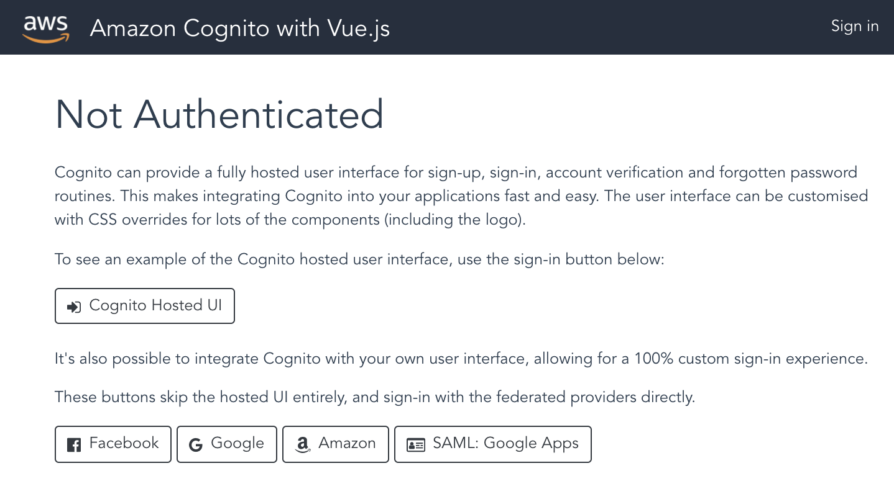

# aws-vuejs-cognito

> An example of using AWS Cognito with Vue.js

More details coming soon...

## Demo 

You can see a live demo of this at [https://cognito.demothe.cloud](https://cognito.demothe.cloud).



## Build Setup

``` bash
# install dependencies
npm install

# serve with hot reload at localhost:8080
npm run dev

# build for production with minification
npm run build

# build for production and view the bundle analyzer report
npm run build --report
```
